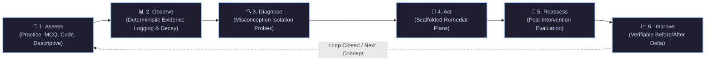
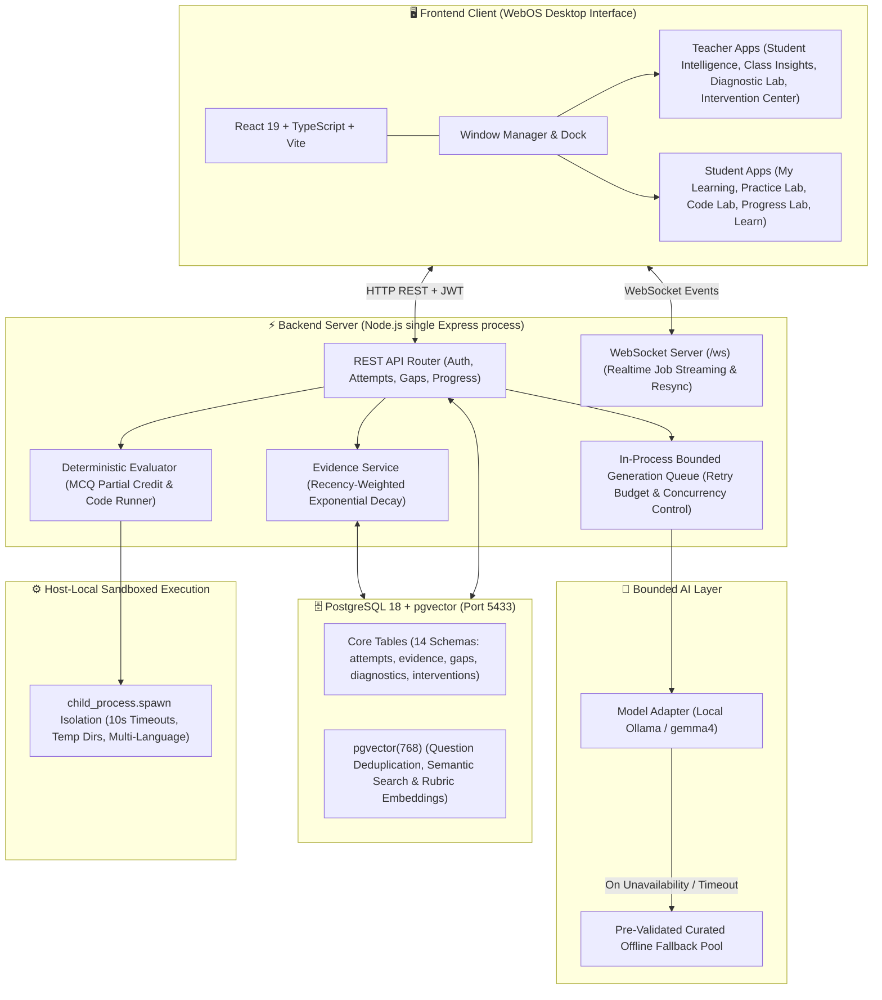
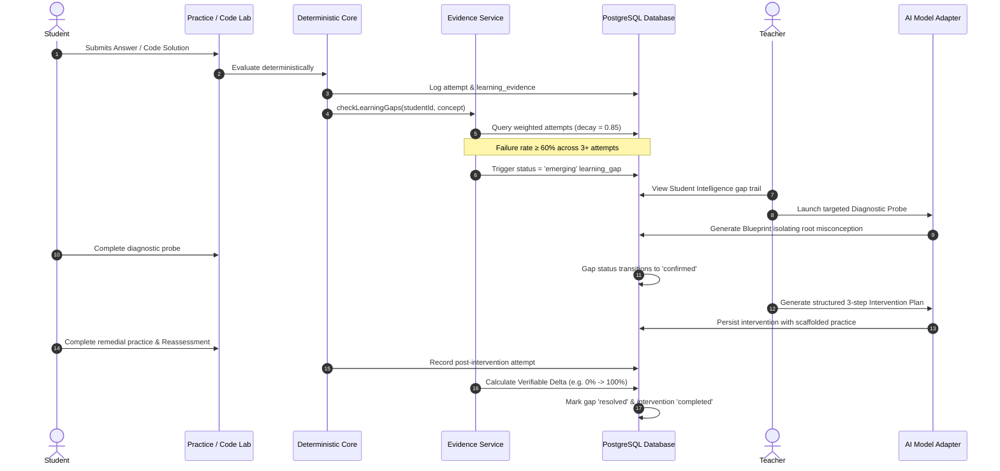

<p align="center">
  
</p>

<h1 align="center">Akademiya</h1>

<p align="center">
  <strong>Evidence-First AI Learning Intelligence & Diagnostic Platform</strong><br>
  <em>Closing the loop between learning difficulties, root misconception diagnosis, targeted pedagogical intervention, and verifiable mastery.</em>
</p>

<p align="center">
  
  
  
  
  
</p>

---

## 🌟 Executive Overview

Most digital learning platforms suffer from two critical flaws:
1. **Opaque, arbitrary metrics**: Students are stamped with unhelpful letter grades or black-box "risk scores" (e.g., *Risk Score: 78%*) without explaining *why* they struggle.
2. **Broken learning loops**: Systems test a student, record a failure, and stop. There is no automated isolation of underlying conceptual misconceptions, no targeted remedial intervention, and no post-reassessment proof of improvement.

**Akademiya** re-engineers digital pedagogy from first principles around a continuous, closed-loop learning engine:

$$\mathbf{Assess} \longrightarrow \mathbf{Observe} \longrightarrow \mathbf{Diagnose} \longrightarrow \mathbf{Act} \longrightarrow \mathbf{Reassess} \longrightarrow \mathbf{Improve}$$

Every feature connects directly to this loop—producing verifiable evidence, detecting emerging gaps, administering diagnostic probes, generating scaffolded interventions, and measuring quantifiable learning gains.

---

## 🔄 Core Learning Loop



---

## 🏛️ System Architecture

Akademiya is intentionally built as a lean, self-contained system. It avoids unnecessary microservices, remote code execution tiers, and expensive cloud dependencies:



---

## 🔬 Evidence & Gap Lifecycle



---

## ✨ Key Architectural Pillars

### 1. 🛡️ Deterministic Core vs. Bounded AI Separation
* **Grading and mastery are never outsourced to generative LLMs.** Pass/fail marks, attempt scoring, gap detection, and evidence logging are 100% deterministic code.
* AI is strictly confined to structured generation tasks (targeted questions, diagnostic blueprints, remedial plans, and conceptual explanations).
* All AI generation operates on strict schemas, hard count caps (max 20), retry budgets (max 3), and transparent fallbacks to a pre-validated offline pool.

### 2. 🔍 Evidence-First Architecture
* **Zero black-box risk scores:** Instead of arbitrary scores like `Risk: 82%`, gaps and diagnostics are rendered as chronological, inspectable evidence items:
  ```text
  Emerging difficulty: Recursion (Base Case Termination)
  Concrete Evidence Observations (3 attempts):
  • Failed Attempt: What condition must be true for recursion to terminate? (practice | 0 pts)
  • Failed Attempt: What occurs if base case is never reached? (practice | 0 pts)
  • Failed Attempt: Trace the call tree for countdown(2)... (practice | 0 pts)
  ```

### 3. ✍️ Dual-Pass Descriptive Answer Evaluation
* Handles open-ended technical explanations without blind LLM trust.
* **Pass 1:** Computes semantic cosine similarity between student answer and teacher reference answer using `pgvector(768)`.
* **Pass 2:** Runs conceptual rubric analysis isolating **covered points** vs. **missed points**.
* Descriptive evidence is recorded with a calibrated **0.6x trust weighting** relative to deterministic code/MCQ evidence.

### 4. 💻 Host-Local Sandboxed Code Lab
* Pure host-local execution for Python, JavaScript, Java, and C/C++ via Node's `child_process.spawn`.
* Enforces isolated temporary directories, process sandboxing, standard stream redirection, and hard 10-second execution timeouts.
* Fully bypasses external third-party execution tiers (such as Judge0 or Piston).

### 5. ⏱️ Deterministic Auto-Attendance
* Automatic session attendance verification based on active teacher-defined time windows.
* Students receive deterministic attendance markers (`source: assignment_completion`) upon submitting coursework during active windows—completely eliminating proxy attendance.

---

## 📱 WebOS Application Ecosystem

Akademiya presents a unified liquid-glass desktop operating system environment featuring 9 specialized applications:

| Category | Application | Icon | Purpose |
|---|---|:---:|---|
| **👩‍🏫 Teacher** | **Student Intelligence** | 🧠 | Inspect individual student learning gaps with full chronological evidence trails. |
| **👩‍🏫 Teacher** | **Class Insights** | 📊 | Conceptual class heatmaps, gap aggregations, and deterministic session auto-attendance. |
| **👩‍🏫 Teacher** | **Diagnostic Lab** | 🔬 | Formulate targeted diagnostic probes and root misconception blueprints. |
| **👩‍🏫 Teacher** | **Intervention Center**| 🎯 | Assign structured 3-stage remedial plans and scaffolded practice sets. |
| **🎓 Student** | **My Learning** | 💡 | Central student cockpit displaying active gaps, assigned plans, and verified progress. |
| **🎓 Student** | **Learn** | 📖 | Structured 1st to 3rd-year CS curriculum (DSA, DBMS, Computer Networks). |
| **🎓 Student** | **Practice Lab** | 📝 | Interactive practice with MCQ (single/multi) and descriptive conceptual questions. |
| **🎓 Student** | **Code Lab** | 💻 | Monaco-powered algorithmic editor with local test verification and AI failure hints. |
| **🎓 Student** | **Progress Lab** | 📈 | Side-by-side before/after evidence cards proving measurable learning deltas. |
| **⚙️ System** | **Settings** | ⚙️ | Profile management, dark/light theme switching, and desktop font scaling. |

---

## 🗄️ Database Schema & Vector Layer

Hosted locally on PostgreSQL 18 with the `pgvector` extension:

```text
Database: akademiya (Port 5433)
├── users                        (Auth, roles: teacher | student)
├── assessments                  (Teacher assessments)
├── questions                    (MCQ, coding, descriptive + embedding vector(768))
├── attempts                     (Student submissions, marks, execution logs)
├── learning_evidence            (Deterministic and weighted attempt records)
├── learning_gaps                (Emerging, confirmed, and resolved gaps)
├── diagnostics                  (Targeted probes and misconception blueprints)
├── diagnostic_attempts          (Student responses to diagnostic questions)
├── interventions                (Scaffolded remedial plans)
├── reassessments                (Post-intervention attempt links)
├── progress                     (Verifiable before/after evidence sets & delta)
├── generation_jobs              (In-process generation queue states)
├── generated_questions         (Validation tracking & retry budgets)
├── coding_challenges            (Algorithmic tests & diagnostic test cases)
├── class_sessions               (Deterministic attendance windows)
└── attendance                   (Session-verified student attendance)
```

---

## 🚀 Quick Start Guide

### Prerequisites
* **Node.js**: v20.x or v22.x
* **Docker** (for PostgreSQL + pgvector)
* **Bun** or **npm**
* *(Optional)* **Ollama** running `gemma4:e4b` locally on port 11434 (the platform automatically falls back to its offline pool if unavailable).

### One-Command Startup

The repository includes an automated startup script that starts the database, launches the Express backend with WebSocket, and brings up the Vite WebOS frontend:

```bash
chmod +x start.sh
./start.sh
```

### Manual Step-by-Step Setup

#### 1. Database (PostgreSQL with pgvector)
Ensure PostgreSQL with `pgvector` is running on port **5433**:
```bash
docker run -d \
  --name akademiya-postgres \
  -e POSTGRES_DB=akademiya \
  -e POSTGRES_USER=postgres \
  -e POSTGRES_PASSWORD=postgres \
  -p 5433:5432 \
  pgvector/pgvector:pg16
```

#### 2. Backend Server
```bash
cd server
npm install
node index.js
# Backend running at http://localhost:5000 (WebSocket at ws://localhost:5000/ws)
```

#### 3. Frontend WebOS Application
```bash
cd app
bun install # or: npm install
bun run dev --host 0.0.0.0 --port 5173
# UI running at http://localhost:5173
```

---

## 🔑 Demo Credentials

You can log in directly using one-click role buttons on the Lock Screen or via email:

| Role | Email | Password |
|---|---|---|
| **👩‍🏫 Teacher** | `teacher.golden@akademiya.io` | `password123` |
| **🎓 Student** | `student.golden@akademiya.io` | `password123` |

---

## 🧪 Automated Verification Suite

Akademiya includes end-to-end automated verification scripts validating the entire closed loop without requiring manual database seeding:

```bash
# Run the full Golden Path automated verification
cd server
node test/verify-golden-path.js
```

**Verification Steps Executed:**
1. **Teacher Seeds Concept:** Question seeded into `questions` table.
2. **AI Generation Pipeline:** Asynchronous job queued, streamed over WebSocket, and validated.
3. **Practice Attempts:** Student answers questions, triggering deterministic evaluation and evidence creation.
4. **Gap Detection:** Recency-weighted decay identifies error patterns and triggers an `emerging` learning gap.
5. **Targeted Diagnostic:** Teacher launches probe; AI generates misconception blueprint; student takes diagnostic.
6. **Pedagogical Intervention:** Teacher assigns structured 3-stage remedial plan.
7. **Reassessment:** Student takes post-intervention test.
8. **Verifiable Delta:** System computes exact before-vs-after accuracy gain (e.g., $0\% \to 100\%$) and resolves the gap.
9. **Secondary Verification:** Validates Class Insights SQL aggregation, Code Lab local runner, and pgvector cosine search.

---

## 📂 Project Structure

```text
Akademiya/
├── app/                        # Frontend Vite + React 19 WebOS
│   ├── src/
│   │   ├── apps/               # Individual OS Micro-Apps (Student Intelligence, Code Lab, etc.)
│   │   ├── os/                 # Desktop OS Environment (Dock, MenuBar, WindowManager)
│   │   ├── context/            # Authentication & Liquid-Glass Theme Providers
│   │   └── index.css           # Modern Design Tokens & Glassmorphism Styles
│   └── package.json
├── server/                     # Backend Single Express Engine
│   ├── ai/                     # Bounded Model Adapter, Ollama client & Fallback Pool
│   ├── jobs/                   # In-process Bounded Generation Job Queue
│   ├── lib/                    # Deterministic Evaluator & Sandboxed Local Runner
│   ├── routes/                 # RESTful Endpoints (Attempts, Diagnostics, Attendance, etc.)
│   ├── services/               # Evidence Service (Decay Aggregation) & Semantic Service (pgvector)
│   ├── test/                   # Golden Path & End-to-End Automated Verification Suites
│   └── index.js                # Server entrypoint & WebSocket listener
├── start.sh                    # Unified one-command system launcher
├── progress.md                 # Complete phase-by-phase implementation log
└── README.md                   # Project Documentation
```

---

<p align="center">
  <sub>Built with rigorous pedagogical design and deterministic integrity for next-generation learning.</sub>
</p>
